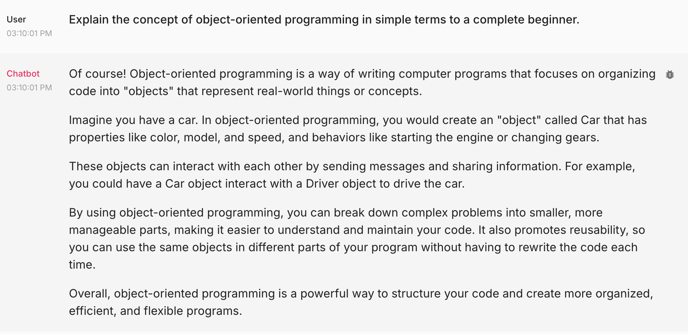
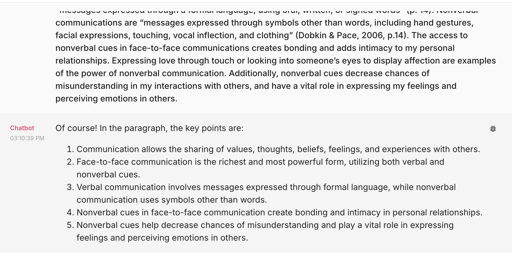
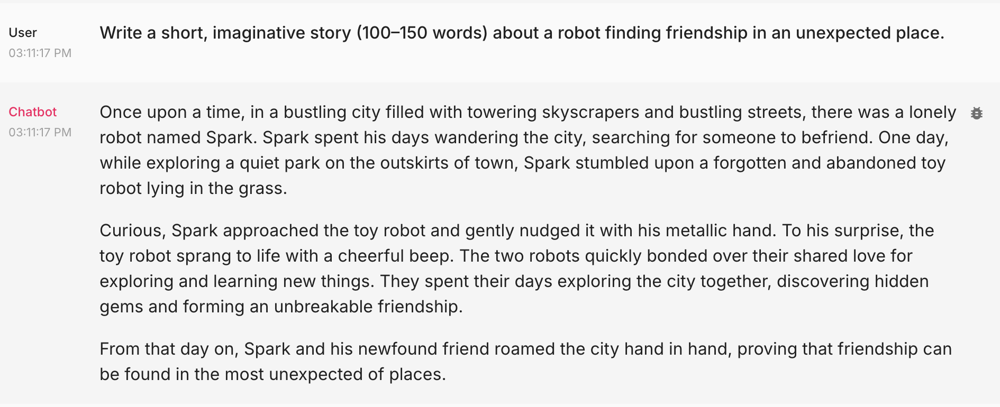
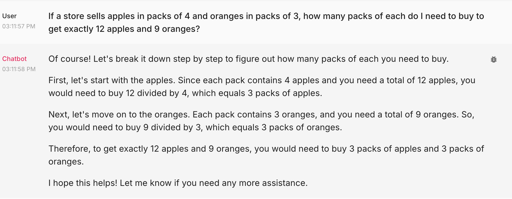
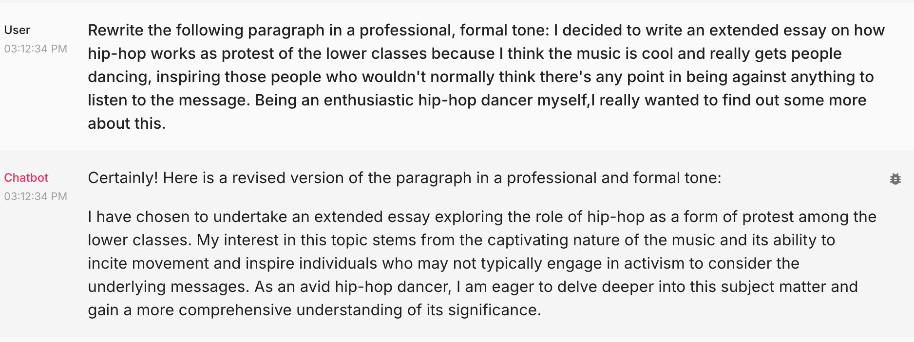
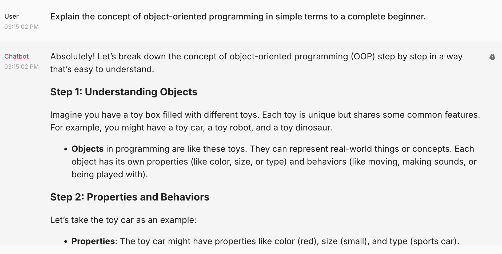

 ##### 🏗️ Activity #1:

Please evaluate your system on the following questions:

1. Explain the concept of object-oriented programming in simple terms to a complete beginner. 
    - Aspect Tested: <b>Question Answering/Summarization</b>

2. Read the following paragraph and provide a concise summary of the key points: It is through the means of communication that I can share my values, thoughts, beliefs, feelings, and experiences with others. Face-to-face communication allows me to use both verbal and nonverbal cues, making it the richest and most powerful form of communication. According to Dobkin and Pace (2006), verbal communication consists of “messages expressed through a formal language, using oral, written, or signed words” (p. 14). Nonverbal communications are “messages expressed through symbols other than words, including hand gestures, facial expressions, touching, vocal inflection, and clothing” (Dobkin & Pace, 2006, p.14). The access to nonverbal cues in face-to-face communications creates bonding and adds intimacy to my personal relationships. Expressing love through touch or looking into someone’s eyes to display affection are examples of the power of nonverbal communication. Additionally, nonverbal cues decrease chances of misunderstanding in my interactions with others, and have a vital role in expressing my feelings and perceiving emotions in others.
    - Aspect Tested: <b>Summarization</b>

Link to sample paragraph: https://academicguides.waldenu.edu/writingcenter/undergraduate/paragraphs/body-a

3. Write a short, imaginative story (100–150 words) about a robot finding friendship in an unexpected place.
    - Aspect Tested: <b>Text Generation</b>

4. If a store sells apples in packs of 4 and oranges in packs of 3, how many packs of each do I need to buy to get exactly 12 apples and 9 oranges?
    - Aspect Tested: <b>Question Answering/Reasoning</b>

5. Rewrite the following paragraph in a professional, formal tone: I decided to write an extended essay on how hip-hop works as protest of the lower classes because I think the music is cool and really gets people dancing, inspiring those people who wouldn't normally think there's any point in being against anything to listen to the message. Being an enthusiastic hip-hop dancer myself,I really wanted to find out some more about this.
    - Aspect Tested: <b>Text Generation/Tone</b>

Link to sample paragraph: https://www.cliffsnotes.com/study-notes/3163792

##### 🚧 Advanced Build:

Please make adjustments to your application that you believe will improve the vibe check done above, push the changes to your HF Space and redo the above vibe check.

<b>I changed the model from gpt-3.5-turbo to gpt-4o-mini (see updated app.py file in llm-app folder).</b>

##### 🧑‍🤝‍🧑❓ Discussion Question #1:

What are some limitations of vibe checking as an evaluation tool?

<b>Vibe checking is mostly subjective aside from checking obvious things like "how many r's are in the word strawberry?" What will seem like a legitimate answer to one person may seem a little suspect to another person.</b>